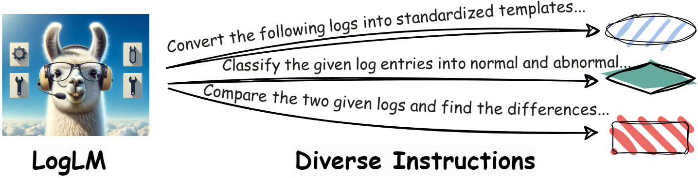
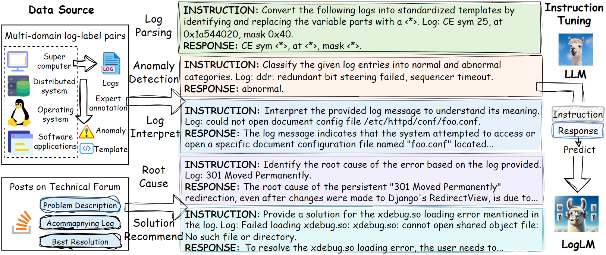
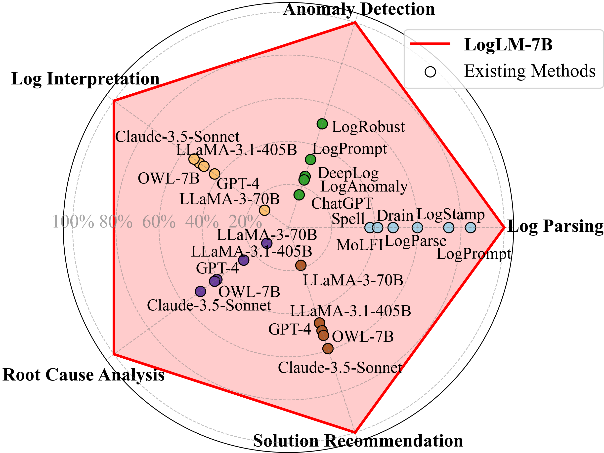
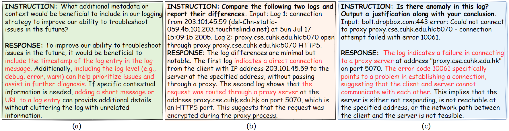

# LogLM

<p align="center">
    
</p>

This repo contains training codes and the human-calibriated instruction dataset for LogLM, an LLM designed for instruction-based log analysis.

Paper: [LogLM: From Task-based to Instruction-based Automated Log Analysis](https://arxiv.org/abs/2410.09352)

## 📰 News
LogLM has been accepted by International Conference on Software Engineering (ICSE) 2025 (SEIP track)🎉🎉🎉🎉🎉🎉.

## 📣 Introduction
<p align="center">
    
</p>

Automatic log analysis is essential for the efficient Operation and Maintenance (O\&M) of software systems, providing critical insights into system behaviors. However, existing approaches mostly treat log analysis as training a model to perform an isolated task, using task-specific log-label pairs. These task-based approaches are inflexible in generalizing to complex scenarios, depend on task-specific training data, and cost significantly when deploying multiple models. In this paper, we propose an instruction-based training approach that transforms log-label pairs from multiple tasks and domains into a unified format of instruction-response pairs. Our trained model, LogLM, can follow complex user instructions and generalize better across different tasks, thereby increasing flexibility and reducing the dependence on task-specific training data. By integrating major log analysis tasks into a single model, our approach also relieves model deployment burden. Experimentally, LogLM outperforms existing approaches across five log analysis capabilities, and exhibits strong generalization abilities on complex instructions and unseen tasks. 

<p align="center">
    
</p>

<p align="center">
    
</p>

## **🔬** Additional experimental results

### Log Parsing

In the task of log parsing, we employed the LLaMA-7B model and fine-tuned it using the manually annotated data provided by LogHub, tailored to the specific domain. Subsequently, we evaluated the model's performance comprehensively using the remaining log data as the test set. The experimental results demonstrate that LogLM exhibits superior performance compared to conventional large language models (LLMs) fine-tuned on the same domain data.

| **Model**                         | **HDFS**  | **Hd**    | **Zk**    | **BGL**   | **HPC**   | **Linux** | **Px**    | **Avg.**  |
| --------------------------------- | --------- | --------- | --------- | --------- | --------- | --------- | --------- | --------- |
| **LogLM**                   | 0.998     | **0.973** | **0.995** | **0.977** | **0.935** | **0.934** | 0.940     | **0.965** |
| **w/o IRS instructions**          | 0.999     | 0.968     | 0.918     | 0.953     | 0.928     | 0.928     | 0.925     | 0.946     |
| **w/o Anomaly instructions**      | 0.999     | 0.914     | 0.936     | 0.909     | 0.927     | 0.932     | **0.944** | 0.937     |
| **w/o multi-domain instructions** | **1.000** | 0.937     | 0.786     | 0.866     | 0.736     | 0.913     | 0.927     | 0.881     |
| **LLaMA-7B**                      | 0.999     | 0.949     | 0.805     | 0.823     | 0.889     | 0.919     | 0.925     | 0.901     |

### Anomaly Detection

In the task of log anomaly detection, we also compared the performance of LLaMA-7B and LogLM using the aforementioned approach on the BGL and Spirit datasets. Meanwhile, we also upsampled the training data of LLaMA-7B in a single domain to match that of LogLM and evaluated its performance. The results indicate that LogLM consistently outperforms LLaMA in detecting anomalies, demonstrating its robustness and superior capability in handling complex log data across different domains.

|   **Model**   |    BGL    |  Spirit   |   Avg.    |
| :-----------: | :-------: | :-------: | :-------: |
|   **LogLM**   | **0.625** | **0.278** | **0.452** |
| **LLaMA-7B**  |   0.203   |   0.073   |   0.138   |
| **Upsampled** |   0.345   |   0.073   |   0.209   |

### Other Log Analysis Tasks

In the tasks of log interpretation, root cause analysis, and solution recommendation, we also compared the performance of the fine-tuned LLaMA-7B with that of LogLM. In the table below, the scores outside the parentheses represent LogLM's performance, while the numbers inside the parentheses indicate the performance of LLaMA-7B. We found that LogLM demonstrated superior performance in the vast majority of tasks.


---

### 1. Log Interpretation Task
| **Model**       | **BLEU** | **ROUGE-1** | **ROUGE-2** | **ROUGE-L** |
|------------------|----------|-------------|-------------|-------------|
| **LogLM**        | **15.584**   | **46.488**      | **23.087**      | 34.769      |
| **LLaMA-7B**     | 15.505   | 46.022      | 23.025      | **35.471**  |

---

### 2. Root Cause Analysis Task
| **Model**       | **BLEU** | **ROUGE-1** | **ROUGE-2** | **ROUGE-L** |
|------------------|----------|-------------|-------------|-------------|
| **LogLM**        | 12.398   | **40.602**      | **19.042**      | **30.227**      |
| **LLaMA-7B**     | **13.436** | 40.322      | 18.889      | 29.942      |

---

### 3. Solution Recommendation Task
| **Model**       | **BLEU** | **ROUGE-1** | **ROUGE-2** | **ROUGE-L** |
|------------------|----------|-------------|-------------|-------------|
| **LogLM**        | **8.241** | **34.415**  | **13.911**  | **25.431**  |
| **LLaMA-7B**     | 6.259    | 30.870      | 11.622      | 23.463      |

---
## 🔰 Installation
```
$ pip install requirements.txt
```
## ✨ Instruction Dataset of LogLM
We created an instruction dataset of 2632 pairs of instruction and response for training LogLM, an instruction-following LLM. The instruction dataset consists of five log analysis tasks and nine distinct log domains.
**This dataset is in the main directory of this repo, named 'Instruction Dataset of LogLM.json'.**

Example:
```
Instruction Dataset of LogLM.json
{
  "Instruction": "Interpret the error message in the given log.",
  "Input": "ValueError: Unable to configure handler 'log_file': [Errno 2] No such file or directory: '/logs/django.log'",
  "Response": "The error message indicates that the Django application's logging system is configured to write logs to a file located at '/logs/django.log'. However, it encountered a ValueError because it could not find the specified file or directory. This could be due to an incorrect path or the directory not existing where it expects to find or create the log file."
}
```
The statistics of the dataset is as follows:
<p align="center">
    
</p>

## 📝 Training LogLM

LogLM in our paper is implemented by fine-tuning LLaMA-2-7B on our curated instruction dataset. Thanks [LLaMA-Factory](https://github.com/hiyouga/LLaMA-Factory) for implementing an efficient tool to fine-tune LLMs. The training steps of LogLM are as follows:


(1) Prepare the environment


Please make sure to install the packages required. For issues related to environment, please refer to LLaMA-Factory v0.3.2.

(2) Register the training dataset


Register the dataset in data/dataset_info.json.  
```
dataset_info.json
{
  "LogLM_train": {
    "file_name": "Instruction Dataset of LogLM.json",
    "file_sha1": "",
    "columns": {
      "prompt": "instruction",
      "query": "input",
      "response": "output"
    }
  }
}
```

(3) Start training (with multiple GPUs)
```
WANDB_MODE=offline deepspeed --include localhost:0,1 --master_port=9905 src/train_bash.py \
    --deepspeed ds_config_zero2.json \
    --stage sft \
    --model_name_or_path [path to Llama-2-7b-hf] \
    --do_train \
    --dataset LogLM_train \
    --template alpaca \
    --finetuning_type full \
    --output_dir [path to model saving] \
    --overwrite_cache \
    --per_device_train_batch_size 32 \
    --gradient_accumulation_steps 1 \
    --lr_scheduler_type cosine \
    --save_strategy "epoch" \
    --save_total_limit 6 \
    --logging_steps 10 \
    --learning_rate 2e-5 \
    --weight_decay 0. \
    --warmup_ratio 0.03 \
    --num_train_epochs 6 \
    --plot_loss \
    --overwrite_output_dir \
    --bf16 True \
    --tf32 True \
```
The config file ds_config_zero2.json can be found in [DeepSpeed](https://github.com/huggingface/transformers/blob/main/tests/deepspeed/ds_config_zero2.json)

(4) Inference


The inference test datasets in the "test set" folder should also be registerd in data/dataset_info.json, the same way as the training dataset. 
```
python src/train_bash.py \
    --stage sft \
    --model_name_or_path [path to Llama-2-7b-hf] \
    --do_predict \
    --dataset [registered name of your test set] \
    --template alpaca \
    --finetuning_type full \
    --checkpoint_dir [path to finetuned model] \
    --output_dir [result saving path] \
    --per_device_eval_batch_size 32 \
    --predict_with_generate
```
For more information, please refer to LLaMA-Factory v0.3.2.
